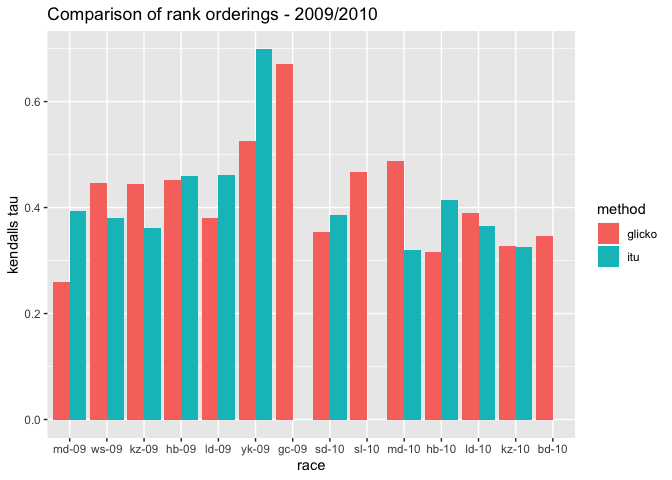

TriathELOn Rankings
================

### Introduction

The aim of this analysis is to develop a new ranking system for elite
triathletes competing on the [ITU triathlon](triathlon.org) World
Triathlon Series, which is the top level of international triathlon
competition. The ranking system will be an application of the famous
[Glicko ranking system](http://glicko.net/glicko.html), most commonly
used for international chess rankings. After the new ranking system is
established, it will be tested against the ITU’s internal ranking system
to determine which is superior in terms of predictive power. Ideally,
the end goal of this ranking system will be to track athlete
development, and backtrack athlete podium pathways.

### What is the Glicko rating system?

The Glicko rating system was created by Professor Mark Glickman to
expand and improve upon the famous [Elo rating
system](https://en.wikipedia.org/wiki/Elo_rating_system), which
attempted to probabilistically rate chess players based on the results
of their matchups. In both the `Elo` and `Glicko` rating systems, each
player is associated with a Rating, and the differences in Ratings
between the two players is what drives the prediction for the outcome of
a match. The larger the difference between two players, the higher the
system will predict the stronger player’s chances to win. In a
Bayesian-esque process, after each match rating points are transferred
from the losing player to the winning player in a zero sum fashion and
both players ratings are updated. The pre match Rating differences
between the two players is what determines the amount of rating points
transferred between the players. If one player was heavily favoured and
won the match, then not a lot of rating points are transferred (this
match has not provided much additional information to the system),
however for two closely ranked players, larger ratings point changes
will occur. <br> The Glicko system expands upon the Elo system by adding
a reliability measure to a players rating, or RD (ratings deviation). In
this way, players who have played more games and played more recently
will have lower ratings deviations, and players who have not played in a
long time will intuitively have higher rating’s deviations. Additional
information and examples about the `Glicko` formula can be found
[here](http://www.glicko.net/glicko/glicko.pdf)

### Adapting Glicko rating system to ITU triathlon

Both the Glicko and Elo rating systems were designed and derived with
2-player zero sum games like chess in mind. To use the system in a
triathlon context I will turn an \(n\)-person triathlon race into
\((n)(n-1)/2\) individual “one-on-one” races. There are a couple
problems with this approach which will be discussed later. Additionally,
a “ratings period” must be determined for each race. In the Glicko
system, the longer since a player has played their last game, the higher
is their ratings deviation. Somewhat arbitrarily, during a WTS season I
have set the difference between races to be “1 period” and the
difference from the last race of a season and the first race of the next
season to be “6 periods”, so that periods roughly align with months
passed.

### Data

I first acquire the WTS results from when the WTS series started in 2009
until the end of 2019, for both men and women. These results were
accessed using [triathlon.org API](https://developers.triathlon.org/),
but all results can also be downloaded via CSV from [triathlon.org
results](https://triathlon.org/results). For each race, I create a
dataframe of normal race results including all finishers, their places,
times and their swim-bike-run splits. Additionally, in order to apply
the `glicko` formula to an \(n\) person triathlon race, I also read in a
`one-vs-one` dataframe, with \(n(n-1)/2\) rows, each row giving the
result of the one vs one race between each pair of competitors.<br>

Cleaned race-results, as well as the `one-vs-one` constructed
dataframes, is included in the `data` directory, as well as notebook
showing how data was accessed and wrangled from the API. Functions used
in this process are included in the `src`
directory.

### WTS race history

| Season | Races                                                                                               |
| ------ | --------------------------------------------------------------------------------------------------- |
| 2009   | Tongyeong, Madrid, Washington, Kitzbuehel, Hamburg, London, Yokohama, **Gold Coast**                |
| 2010   | Sydney, **Seoul**, Madrid, Hamburg, London, Kitzbuehel, **Budapest**                                |
| 2011   | Sydney, Madrid, Kitzbuehel, Hamburg, London, Lausanne, **Beijing, Yokohama**                        |
| 2012   | Sydney, **San Diego, Madrid**, Kitzbuehel, Hamburg, Stockholm, **Yokohama**, Auckland               |
| 2013   | Auckland, San Diego, Yokohama, Madrid, Kitzbuehel, Hamburg, Stockholm, London                       |
| 2014   | Auckland, Cape Town, Yokohama, London, Chicago, Hamburg, Stockholm, Edmonton                        |
| 2015   | Abu Dhabi, Auckland, Gold Coast, Cape Town, Yokohama, London, Hamburg, Stockholm, Edmonton, Chicago |
| 2016   | Abu Dhabi, Gold Coast, Cape Town, Yokohama, Leeds, Stockholm, Hamburg, Edmonton, Cozumel            |
| 2017   | Abu Dhabi, Gold Coast, Yokohama, Leeds, Hamburg, Edmonton, Montreal, Stockholm, Rotterdam           |
| 2018   | Abu Dhabi, Bermuda, Yokohama, Leeds, **HAMBURG**, Edmonton, Montreal, Gold Coast                    |
| 2019   | Abu Dhabi, Bermuda, Yokohama, Leeds, Montreal, Hamburg, **EDMONTON**, **LAUSANNE**                  |

<br> **Bold font**: itu results do not have pre-race rankings <br>
**CAPS LOCK BOLD**: did not have results file in API call
<br>

``` r
calendar <- list("2009" = c("Tongyeong", "Madrid", "DC", "Kitzbuehel", "Hamburg", "London", "Yokohama", "Coast"),
                 "2010" = c("Sydney", "Seoul", "Madrid", "Hamburg", "London", "Kitzbuehel", "Budapest"),
                "2011" = c("Sydney", "Madrid", "Kitzbuehel", "Hamburg", "London", "Championships", "Beijing", "Yokohama"),
                "2012" = c("Sydney", "Diego", "Madrid", "Kitzbuehel", "Hamburg", "Stockholm", "Yokohama", "Auckland"),
                "2013" = c("Auckland", "Diego", "Yokohama", "Madrid", "Kitzbuehel", "Hamburg", "Stockholm", "London"),
                "2014" = c("Auckland", "Town", "Yokohama", "London", "Chicago", "Hamburg", "Stockholm", "Edmonton"),
                "2015" = c("Dhabi", "Auckland", "Coast", "Town", "Yokohama", "London", "Hamburg", "Stockholm", "Edmonton", "Chicago"),
                "2016" = c("Dhabi", "Coast", "Town", "Yokohama", "Leeds", "Stockholm", "Hamburg", "Edmonton", "Cozumel"),
                "2017" = c("Dhabi", "Coast", "Yokohama", "Leeds", "Hamburg", "Edmonton", "Montreal", "Stockholm", "Rotterdam"),
                "2018" = c("Dhabi", "Bermuda", "Yokohama", "Leeds", "Edmonton", "Montreal", "Coast"),
                "2019" = c("Dhabi", "Bermuda", "Yokohama", "Leeds", "Montreal", "Hamburg"))
years <- names(calendar)
male_races <- list()
female_races <- list()

for (i in seq_along(calendar)){
    year <- as.numeric(years[i])
    series <- calendar[[i]]
    for (race in series){
        male_race_df <- read_csv(paste0("../data/",year,"_races/races_clean/",race,"_male.csv"), 
                     col_types = cols())
        female_race_df <- read_csv(paste0("../data/",year,"_races/races_clean/",race,"_female.csv"), 
                     col_types = cols())
        male_ovo_df <- read_csv(paste0("../data/",year,"_races/ovo_races/",race,"_male.csv"),
                        col_types = cols())
        female_ovo_df <- read_csv(paste0("../data/",year,"_races/ovo_races/",race,"_female.csv"),
                        col_types = cols())
        male_tuple <- list(male_race_df, male_ovo_df)
        female_tuple <- list(female_race_df, female_ovo_df)
        
        male_races[[length(male_races)+1]] <-  male_tuple
        
        female_races[[length(female_races)+1]] <- female_tuple
    }
}
```

### Ranking metrics

In order to compare different ranking systems, we need some objective
measures. I will be using the ranking as the independent variable, and
race result as the dependent variable. I will then compare different
ranking system using two different metrics, `adjusted R-squared` and
`Kendall's tau`. The`R-squared` measure is widely used as measure of
goodness of fit in a linear regression, and measures the proportion of
variation in the dependent variable explained by the independent
variable, and `Kendall's tau` coefficient measures the ordinal
relationship between two columns. To compare two “pre-race rankings”,
one can calculate a `Kendall's tau` coefficient between each ranking and
the final race results, and see which ranking system has a higher
coefficient. A `Kendall's tau` of 0 indicates no relationship, and a
`Kendall's tau` value of 1 indicates a perfect relationship. The formula
for `Kendall's tau` is as
follows:

\[\text{kendall's tau} = \frac{\text{number of concordant pairs - number of discordant pairs}}{\text{total number of pairs}}\]

For example, the vectors \[1,3,2\] and \[1,2,3\] would have a `Kendall's
tau` coefficient of 1/3, calculated as:<br>

\[
\frac{2 - 1}{3} = 0.333
\]

## Glicko Model

### Initial value of players

For new players entering the system, they are given the default values
from the `PlayerRatings` package of a Rating of 1500, and a Rating
Deviation of 350. In the first race, everyone is new and all start with
this rating, and as the season and years progress the number of new
players in each race decreases.

### Determining value of parameter c

In the `glicko` formula, the ratings deviation of a player will decrease
with every performance gathered from them, and the ratings deviation of
a player will increase the greater period of time since their last
performance. The parameter `c` is governs the increase in uncertainty
between ratings periods. <br> To determine the optimal level of `c`, for
each of the last 14 races in our dataset I can calculate the value of
Kendall’s tau for a given level of `c`. Then, I can take the average of
these measurements, and compare the average kendall’s tau values for
each level of `c`.

**Process to determine the optimal value of c**<br>

  - for each level of C<br> —\> for each race in the dataset<br> ——\>
    update race results dataframe with previous glicko rankings, and
    rank athletes according to their glicko rankings<br> ——\> determine
    kendall’s tau correlation between glicko rankings and their finish
    results<br> ——\> determine R^2 between glicko rankings and their
    finish results ——\> use the results of the race to appropriately
    update the glicko rankings<br>

#### Find optimal C- male

``` r
### Find optimal level of C
c_vec <- seq(2, 20, by=2)

# Period incrementer for races
average_results_male <- data.frame(matrix(NA, nrow = length(c_vec), ncol = 2))
iterator <- 1
# DF to store results at different levels of c
# iterate through each c
for (c in c_vec){
    # reset period
    period <- 1
    # reset glicko and correlations to the 1st race
    first_race_male <- male_races[[1]][2]
    glicko <- glicko_ratings(first_race_male)
    rankings_df <- updated_rankings(glicko)
    # keep track of glicko's and of R^2 values
    correlation_tracker <- rep(NA, length(male_races))
    r2_tracker <- rep(NA, length(male_races))
    
    # iterate through each race in the series
    for (race in male_races){
        race_df <- race[[1]]
        race_ovo <- race[[2]]
        # adjust period for the glicko race objects
        period <- period + 1
        # pass in rotating value of c
        update <- race_update(glicko, rankings_df, race_df, race_ovo, c)
        # save results from the update for use in next iteration
        glicko <- update[[1]]
        rankings_df <- update[[2]]
        correlation_tracker[period-1] <- update[[3]]
        r2_tracker[period-1] <- update[[4]]
    }
    # Find the average kendall's tau at that level of C
    average_results_male[iterator,1] <- correlation_tracker %>% mean()
    # Find the average R2 at that level of C
    average_results_male[iterator,2] <- r2_tracker %>% mean()
    iterator <- iterator + 1
}
results_summary_male <- tibble(c = c_vec, average_kendall_tau = average_results_male[[1]], 
                         average_R_squared = average_results_male[[2]])
best_c_male <- results_summary_male  %>% arrange(desc(average_R_squared)) %>% select(c) %>% head(1) %>% pull()
best_c_male
```

    ## [1] 4

#### Find optimal C - female

``` r
### Find optimal level of C
average_results_female <- data.frame(matrix(NA, nrow = length(c_vec), ncol = 2))
# Period incrementer for races
iterator <- 1

# DF to store results at different levels of c
# iterate through each c
for (c in c_vec){
    # reset period
    period <- 1
    # reset glicko and correlations to the 1st race
    first_race_female <- female_races[[1]][2]
    glicko <- glicko_ratings(first_race_female)
    rankings_df <- updated_rankings(glicko)
    # keep track of glicko's and of R^2 values
    correlation_tracker <- rep(NA, length(female_races))
    r2_tracker <- rep(NA, length(female_races))
    
    # iterate through each race in the series
    for (race in female_races){
        race_df <- race[[1]]
        race_ovo <- race[[2]]
        # adjust period for the glicko race objects
        period <- period + 1
        # pass in rotating value of c
        update <- race_update(glicko, rankings_df, race_df, race_ovo, c)
        # save results from the update for use in next iteration
        glicko <- update[[1]]
        rankings_df <- update[[2]]
        correlation_tracker[period-1] <- update[[3]]
        r2_tracker[period-1] <- update[[4]]
    }
    # Find the average kendall's tau at that level of C
    average_results_female[iterator,1] <- correlation_tracker %>% mean()
    # Find the average R2 at that level of C
    average_results_female[iterator,2] <- r2_tracker %>% mean()
    iterator <- iterator + 1
}
results_summary_female <- tibble(c = c_vec, average_kendall_tau = average_results_female[[1]], 
                         average_R_squared = average_results_female[[2]])
best_c_female <- results_summary_female  %>% arrange(desc(average_R_squared)) %>% select(c) %>% head(1) %>% pull()
best_c_female
```

    ## [1] 12

## Comparing glicko rankings to ITU rankings

Now that the optimal `c` level has been found to be 4 for men, and 12
for women, we can compare the two ranking systems (ITU rankings and
Glicko rankings) in terms of their predictive power. To do this, the
process will be similar to above, except now we are working with a fixed
value of `c`, and are also calculating the `kendall's tau` and `adjusted
R^2` for the ITU ranking system. The process followed is: <br><br>

  - for each race in the dataset<br> —\> update race results dataframe
    with previous glicko rankings, and rank athletes according to their
    glicko rankings<br> —\> determine kendall’s tau correlation and R^2
    between glicko rankings and finish results<br> —\> determine
    kendall’s tau correlation and R^2 between itu rankings and finish
    results<br> —\> use the results of the race to appropriately update
    the glicko rankings<br>

#### Compare systems

``` r
# Track the kendall's tau between both approaches
tau_glicko_male <- rep(NA, length(male_races))
tau_itu_male <- rep(NA, length(male_races))

r2_glicko_male <- rep(NA, length(female_races))
r2_itu_male <- rep(NA, length(female_races))

# reset glicko and correlations
first_race_male <- male_races[[1]][2]
glicko <- glicko_ratings(first_race_male)
rankings_df <- updated_rankings(glicko)

# iterate through each race
count <- 1
for (race in male_races){
        race_df <- race[[1]]
        race_ovo <- race[[2]]
        # pass in optimal value of C
        update <- race_update(glicko, rankings_df, race_df, race_ovo, c = best_c_male)
        # pass in results from the update for use in next iteration
        glicko <- update[[1]]
        rankings_df <- update[[2]]
        # just a list
        tau_glicko_male[count] <- update[[3]]
        r2_glicko_male[count] <- update[[4]]
        tau_itu_male[count] <- cor(race_df$start_number, race_df$position, method = "kendall")
        if (race_df %>% select(start_number) %>% unique() %>% pull() %>% length() > 1) {
            r2_itu_male[count] <- summary(lm(race_df$position~race_df$start_number))$adj.r.squared
        }
        count <- count + 1
}

# Track the kendall's tau between both approaches
tau_glicko_female <- rep(NA, length(female_races))
tau_itu_female <- rep(NA, length(female_races))

r2_glicko_female <- rep(NA, length(female_races))
r2_itu_female <- rep(NA, length(female_races))

# reset glicko and correlations
first_race_female <- female_races[[1]][2]
glicko <- glicko_ratings(first_race_female)
rankings_df <- updated_rankings(glicko)

# iterate through each race
count <- 1
for (race in female_races){
        race_df <- race[[1]]
        race_ovo <- race[[2]]
        # pass in optimal value of C
        update <- race_update(glicko, rankings_df, race_df, race_ovo, c = best_c_female)
        # pass in results from the update for use in next iteration
        glicko <- update[[1]]
        rankings_df <- update[[2]]
        # just a list
        tau_glicko_female[count] <- update[[3]]
        r2_glicko_female[count] <- update[[4]]
        tau_itu_female[count] <- cor(race_df$start_number, race_df$position, method = "kendall")
        if (race_df %>% select(start_number) %>% unique() %>% pull() %>% length() > 1) {
            r2_itu_female[count] <- summary(lm(race_df$position~race_df$start_number))$adj.r.squared
        }
        count <- count + 1
    }
```

To compare the results of the two methods, I will show the yearly
average `Kendall's tau` as well as `R-squared` coefficient for both
methods in each of the last 7 years of the dataset (2013-2019). I do not
perform these direct comparisons on the 2009-2012 seasons, as in these
seasons ITU pre race rankings are missing for 1-2 races per
year.

### Average scores across seasons - Female

``` r
year <- c(rep(2009, length(calendar$'2009')), rep(2010, length(calendar$'2010')), rep(2011, length(calendar$'2011')), rep(2012, length(calendar$'2012')),
  rep(2013, length(calendar$'2013')), rep(2014, length(calendar$'2014')), rep(2015, length(calendar$'2015')), rep(2016, length(calendar$'2016')),
  rep(2017, length(calendar$'2017')), rep(2018, length(calendar$'2018')), rep(2019, length(calendar$'2019')))

female_results <- tibble(r2_itu_female, r2_glicko_female, tau_itu_female, tau_glicko_female, year)
tidy_female <- female_results %>% gather("metric", "score", -year)

year_summaries_female <- tidy_female %>%
                        filter(year  > 2012)  %>%
                        group_by(year, metric) %>%
                        summarize(average_score = mean(score))

# create and display plots
r2_female <- year_summaries_female %>% filter(metric == "r2_glicko_female" | metric == "r2_itu_female")
kendall_female <- year_summaries_female %>% filter(metric == "tau_glicko_female" | metric == "tau_itu_female")

r2_plot_female <- ggplot(r2_female) + aes(x = year, y = average_score, colour = metric) +
    geom_line() + coord_cartesian(ylim = c(0, 1)) +
    labs(y = "Yearly average R2", 
         title = "R2 comparisons between ITU rankings and glicko scores- Female")

kendall_plot_female <- ggplot(kendall_female) + aes(x = year, y = average_score, colour = metric) +
    geom_line() + coord_cartesian(ylim = c(0, 1)) +
    labs(y = "Yearly average Kendall's Tau", 
         title = "Kendall's Tau comparisons between ITU rankings and glicko scores- Female")

grid.arrange(r2_plot_female, kendall_plot_female, nrow = 2)
```

<!-- -->

#### Summary stats - female

``` r
tidy_female %>%
      filter(year > 2012) %>%
      group_by(metric) %>%
      summarise(mean_metric = mean(score))
```

    ## # A tibble: 4 x 2
    ##   metric            mean_metric
    ##   <chr>                   <dbl>
    ## 1 r2_glicko_female        0.369
    ## 2 r2_itu_female           0.324
    ## 3 tau_glicko_female       0.450
    ## 4 tau_itu_female          0.417

### Average scores across seasons - Male

``` r
male_results <- tibble(r2_itu_male, r2_glicko_male, tau_itu_male, tau_glicko_male, year)
tidy_male <- male_results %>% gather("metric", "score", -year)

year_summaries_male <- tidy_male %>%
                        filter(year  > 2012)  %>%
                        group_by(year, metric) %>%
                        summarize(average_score = mean(score))

# create and display plots
r2_male <- year_summaries_male %>% filter(metric == "r2_glicko_male" | metric == "r2_itu_male")
kendall_male <- year_summaries_male %>% filter(metric == "tau_glicko_male" | metric == "tau_itu_male")

r2_plot_male <- ggplot(r2_male) + aes(x = year, y = average_score, colour = metric) +
    geom_line() + coord_cartesian(ylim = c(0, 1)) +
    labs(y = "Yearly average R2", 
         title = "R2 comparisons between ITU rankings and glicko scores- Male")

kendall_plot_male <- ggplot(kendall_male) + aes(x = year, y = average_score, colour = metric) +
    geom_line() + coord_cartesian(ylim = c(0, 1)) +
    labs(y = "Yearly average Kendall's Tau", 
         title = "Kendall's Tau comparisons between ITU rankings and glicko scores- Male")

grid.arrange(r2_plot_male, kendall_plot_male, nrow = 2)
```

<!-- -->

#### Summary stats - male

``` r
tidy_male %>%
      filter(year > 2012) %>%
      group_by(metric) %>%
      summarise(mean_metric = mean(score))
```

    ## # A tibble: 4 x 2
    ##   metric          mean_metric
    ##   <chr>                 <dbl>
    ## 1 r2_glicko_male        0.329
    ## 2 r2_itu_male           0.303
    ## 3 tau_glicko_male       0.423
    ## 4 tau_itu_male          0.400

### Discussion of results

In all four comparisons (Kendalls and R^2 for both men and women), the
Glicko rankings outperform the ITU rankings. This can be seen through
the overall averages, as well as on the yearly average plots, where
Glicko consistently slightly outperforms ITU. Glicko rankings may be a
viable ranking metric to use for tracking athletes, and learning about
podium pathways.

### Further improvements

  - Including the racing tier one below the WTS (World Cup races) would
    be helfpful for multiple reasons. Firstly, it would provide more
    information on athletes in the system as we would have more
    information on athletes competing in both levels of play. Currently
    for athletes making their WTS debut we have assigned their initial
    rating to the default 1500 rating. However, if we included WC races,
    for these athletes we would likely already have a ranking via
    performances at the World Cup level, which should improve predictive
    performance in their first WTS race.
  - It may be interesting to also have individual `swim`, `bike` and
    `run` glicko rankings in addition to their overall rankings. This
    could be used for more advanced prediction taking into account
    specific course demands. For example, on courses where historically
    races have come together with large packs off the bike, the pre race
    `run` glicko ranking would be more important than on other more
    challenging bike courses, etc.

### Issues with applying Glicko formula

  - The main issue with applying the glicko formula to an n-person
    triathlon race is that one `performance` has become ~50
    performances, and therefore incorrectly low Ratings Deviations are
    achieved quickly. A quick and dirty resolution to this is to set the
    minimum Ratings Deviation to 30, which is a measure suggested by
    Prof. Glickman and ensures that meaningful changes in performance
    level can always be made.
  - Handling DNF’s. For simplicity, these were removed from race
    datasets, and only finish positions were used to influence the
    updated glicko rating system at each step. It is difficult to
    determine the best one size fits all approach to DNFs for the simple
    reason that they are often not random. Many DNFs are random (bike
    crashes, etc), however there are certainly many cases where an
    athlete may DNF when they are having a poor performance. In these
    cases, their glicko rankings really should drop on account of this,
    but as they are being removed from the results, their ranking will
    not change (ratings deviation will increase however).
